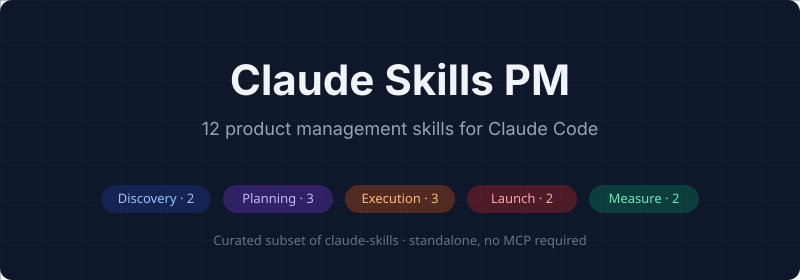
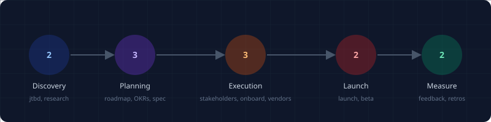

<p align="center">
  
</p>

# Claude Skills PM

[](#whats-included)
[](LICENSE)

A focused 12-skill product management subset of [claude-skills](https://github.com/rampstackco/claude-skills). Designed for product managers, founders wearing a PM hat, and in-house teams who want PM workflow depth in Claude Code without loading the full 99-skill catalog.

## Why a PM-focused subset

Product management is its own discipline with established frameworks: JTBD, OKRs, PRDs, roadmaps, launch playbooks, post-mortems. These workflows have been documented for decades and don't change because AI tools changed. What does change: how PMs use AI to do the work faster and more consistently.

This repo packages the universally-applicable PM workflows from the full claude-skills catalog into a focused set. Load it in Claude Code and your sessions are focused on PM operations: discovery, planning, specification, execution, launch, measurement.

When you need adjacent disciplines (SEO, design, content, dev), pair with the other repos in the family.

## The PM lifecycle

<p align="center">
  
</p>

The 12 skills map to the 5 phases of the product management lifecycle. Skills within each phase can be used independently; the phases themselves typically run sequentially within a single product or feature cycle.

## What's included

### Discovery (2)

| Skill | Purpose |
|---|---|
| jtbd-framing | Jobs to Be Done analysis for understanding why customers buy |
| discovery-research-synthesis | Synthesizing interviews, surveys, and observational research into actionable insights |

### Planning (3)

| Skill | Purpose |
|---|---|
| roadmap-planning | Quarterly and annual roadmap design |
| okr-design | Objectives and key results for teams and individuals |
| pm-spec-writing | Writing PRDs, product specs, and engineering briefs |

### Execution (3)

| Skill | Purpose |
|---|---|
| stakeholder-communication | Managing stakeholders, status updates, and difficult conversations |
| team-onboarding-playbook | Onboarding new team members onto a product |
| vendor-evaluation | Evaluating and selecting vendors and tools |

### Launch (2)

| Skill | Purpose |
|---|---|
| feature-launch-playbook | Coordinating feature launches across engineering, design, marketing |
| beta-program-management | Running closed and open beta programs |

### Measurement (2)

| Skill | Purpose |
|---|---|
| user-feedback-aggregation | Synthesizing user feedback across channels |
| after-action-report | Retrospectives and post-mortems for shipped features |

## Installation

Clone this repository into your Claude Code skills directory, or fork it and customize.

```bash
git clone https://github.com/rampstackco/claude-skills-pm.git
```

Then point Claude Code at the `skills/` directory according to your harness's configuration.

## When to use the full catalog instead

Reach for the full [claude-skills](https://github.com/rampstackco/claude-skills) catalog if you need:

- **Specialized work outside PM**: SEO, content, brand, design, conversion optimization, paid media, analytics, engineering
- **Adjacent skills**: experiment design, experimentation analytics, internationalization, vendor procurement for technical infrastructure
- **Cross-discipline coordination at scale**: when one initiative spans multiple skill domains

The full catalog covers 99 skills across 16 categories. This PM subset covers 12 of them.

## Family repos

This catalog is part of the Claude Skills family. Other family repos:

| Repo | Focus | Skills |
|---|---|---|
| [claude-skills](https://github.com/rampstackco/claude-skills) | Full catalog | 99 |
| [claude-skills-starter](https://github.com/rampstackco/claude-skills-starter) | General-purpose lite | 14 |
| [claude-skills-seo](https://github.com/rampstackco/claude-skills-seo) | SEO consulting | 12 |
| [claude-skills-widgets](https://github.com/rampstackco/claude-skills-widgets) | UI patterns + components | 65 + 32 |
| [awesome-claude-skills](https://github.com/rampstackco/awesome-claude-skills) | Curated discovery list | n/a |

Each family repo is MIT-licensed, conforms to the [Agent Skills Specification](https://agentskills.io), and is stack-agnostic. Use the full catalog for breadth; use a specialty subset when working in one domain.

## Pairing patterns

| Working on | Load this combo |
|---|---|
| Pure product management | claude-skills-pm |
| PM + SEO research | claude-skills-pm + claude-skills-seo |
| PM + product launches with landing pages | claude-skills-pm + claude-skills-widgets |
| Full-stack product work | claude-skills (full catalog) |
| Onboarding to Claude Code | claude-skills-starter |

## Contributing

This repository is curated rather than open to broad contribution. The skill list is deliberately focused on universally-applicable PM workflows. Skill content changes should be made to the source repository at [claude-skills](https://github.com/rampstackco/claude-skills); changes accepted there can be re-synced here.

If you spot an issue with how the PM subset has copied or referenced a skill, or you want to propose a different PM skill cut, open an issue or start a discussion.

## License

MIT. Use freely in commercial and non-commercial projects.
